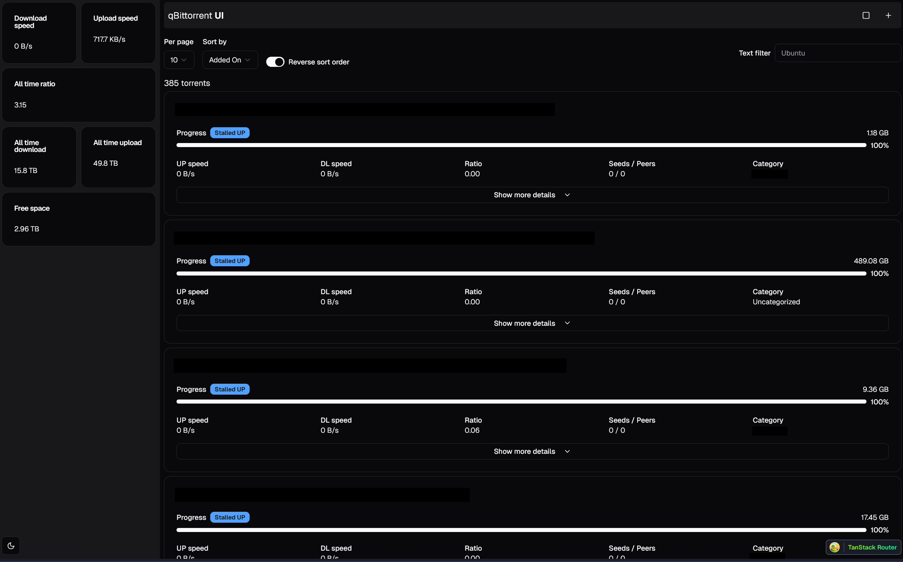

# qBittorrent UI

qBittorrent UI is a modern web interface for managing your qBittorrent client. It leverages the latest web technologies to provide a seamless and efficient user experience.

## Features

- **Real-time Updates**: Well, almost real-time.
- **Responsive Design**: Enjoy a consistent experience across all devices with a fully responsive UI. Sidebar is still WIP.
- **Advanced Filtering**: Easily filter and search through your torrents with advanced filtering options.
- **Batch Operations**: Perform batch operations on multiple torrents for increased productivity.
- **Customizable Interface**: Tailor the interface to your preferences with customizable themes.

## Technologies Used

It was a SolidStart project but then I realized that the shadcn/ui port for SolidJS was not up to date compared to the original React version, so I decided to use React instead.

- **React**: For building the user interface.
- **Zustand**: For state management.
- **Tailwind CSS**: For styling.
- **Vite**: For fast development and build processes.
- **React Query**: For data fetching and caching.
- **shadcn/ui**: For accessible UI components.
- **Tanstack Router**: For routing.
